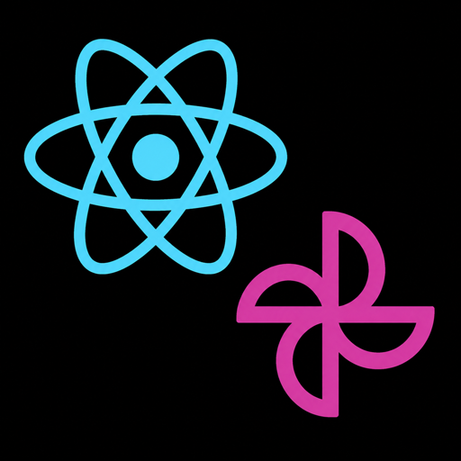

<p align="center">
  
</p>

<h1 align="center">React Native macOS · Uniwind</h1>

<p align="center">
  A polished, minimal desktop starter for building native macOS apps with React Native, TypeScript, and Uniwind.
</p>

<p align="center">
  
  <a href="https://github.com/microsoft/react-native-macos"></a>
  <a href="https://www.typescriptlang.org/"></a>
  <a href="https://github.com/unjunland/uniwind"></a>
  <a href="https://pnpm.io/"></a>
</p>

<p align="center">
  
  
</p>

<br />

## ✨ What is this?

This repository is a clean starting point for a **native macOS desktop app**. It combines the React Native macOS runtime with a small TypeScript codebase, utility-first styling through Uniwind, and Phosphor icons out of the box.

The sample screen is intentionally simple: it gives you a friendly visual check that the toolchain is working, then gets out of your way. Replace `src/App.tsx` and start shaping it into your own app. 🛠️

> ⚠️ This template targets **macOS only**. It is not configured for iOS or Android.

## 🚀 Included

- 🖥️ Native macOS target powered by `react-native-macos`
- ⚛️ React Native 0.81 with the New Architecture enabled
- 🎨 Uniwind + Tailwind CSS v4-style utility classes
- 🧩 TypeScript with React Native type checking
- 🌓 Light/dark appearance support via `useColorScheme`
- 🎯 Phosphor React Native icons
- 📦 pnpm-first scripts with a convenient development workflow
- 🍎 A ready-to-use macOS app icon and Xcode project

## 🧰 Tech stack

| Layer | Choice |
| --- | --- |
| UI runtime | React Native `0.81` + React Native macOS `0.81` |
| Language | TypeScript `5` |
| Styling | Uniwind `1` + Tailwind CSS `4` |
| Icons | Phosphor React Native |
| Package manager | pnpm `10` |
| Native tooling | Xcode + CocoaPods |

## 📁 Project layout

```text
rn-macos-uniwind/
├── src/
│   ├── App.tsx             # Starter screen and first component to edit
│   ├── globals.css         # Uniwind/Tailwind entry styles
│   └── uniwind-types.d.ts  # Uniwind TypeScript declarations
├── macos/
│   ├── rn-uw.xcodeproj/    # Native macOS project
│   └── rn-uw-macOS/        # App delegate, entitlements, storyboard, assets
├── app.json                # App metadata
├── package.json            # Scripts and dependencies
└── README.md
```

## ⚡ Quick start

### Prerequisites

- macOS with Xcode installed
- Node.js `20.19.4` or newer
- pnpm `10` or newer
- Ruby and Bundler

### 1. Install JavaScript dependencies

```bash
pnpm install
```

### 2. Install Ruby and CocoaPods dependencies

```bash
ruby -S bundle install
cd macos
ruby -S bundle exec pod install
cd ..
```

### 3. Start the app

In one terminal, start Metro:

```bash
pnpm start
```

In another terminal, build and launch the macOS app:

```bash
pnpm macos
```

Or run both processes with the combined development script:

```bash
pnpm dev
```

## 🧑‍💻 Development scripts

| Command | Description |
| --- | --- |
| `pnpm start` | Start the Metro bundler |
| `pnpm macos` | Build and run the macOS app |
| `pnpm dev` | Start Metro and launch macOS when ready |
| `pnpm lint` | Run ESLint |
| `pnpm format` | Format the project with Prettier |

## 🎨 Start building

1. Open [`src/App.tsx`](src/App.tsx).
2. Replace the sample content with your first screen.
3. Add utility classes directly with `className`.
4. Use `useColorScheme()` when a component needs light/dark variants.
5. Add native macOS configuration in [`macos/`](macos/) only when your app needs it.

Example:

```tsx
<View className="flex-1 items-center justify-center bg-white dark:bg-slate-950">
  <Text className="text-3xl font-bold text-slate-900 dark:text-white">
    Hello, macOS 👋
  </Text>
</View>
```

## 🩹 Troubleshooting

If CocoaPods reports a transient installation error, run the install command again. Native dependency resolution can occasionally fail while fetching or compiling a pod.

If Metro is already running on port `8081`, stop the existing process before using `pnpm dev`.
